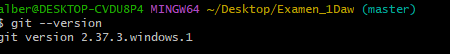

# ENTORNOS DE DESARROLO

## UT1.-Elementos de desarrolo de softwarew
1. Desarrollo de software(metodologias tradicionales)

    i.Modelo Cascada

   ii.Modelo Evolutivo  

2. Metodologias  agiles 

## UT2.- instalacion y uso de entornos de desarrollo

- IntelliJ  IDEA 

- Eclipse 

- NetBeans 

## UT3.- Sistema de Control de versiones
    `git --version`
 

todo esto esta en el [Aula Virtual](https://www.educa2.madrid.org/educamadrid/aula-virtual)